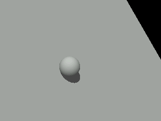
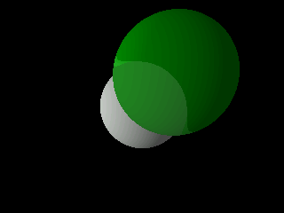
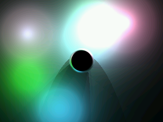
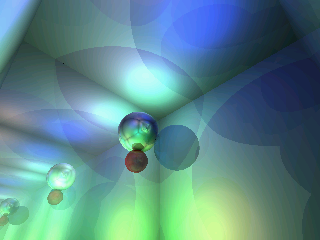
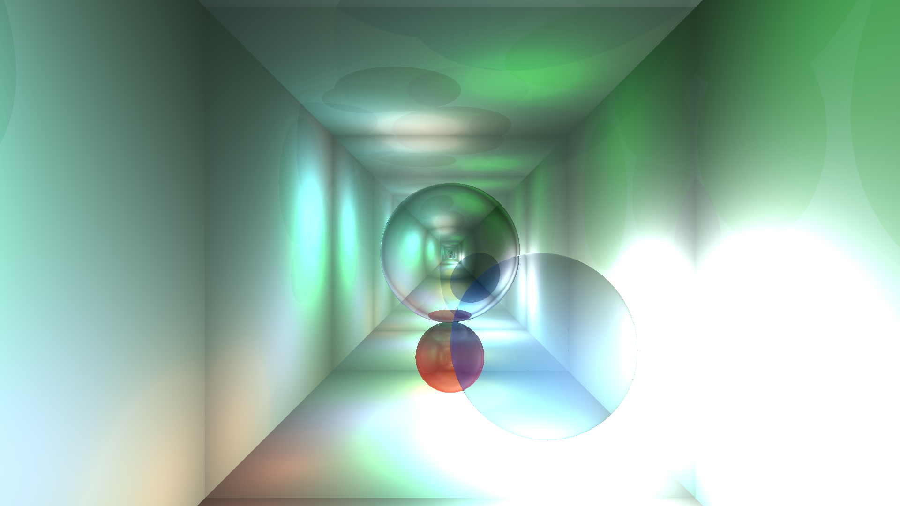

Ray Tracer
===========================================================

Authors: Alex Epp ([alex-epp](https://github.com/alex-epp)), Mitchell Epp ([mdepp](https://github.com/mdepp))

<table>
  <tr>
    <td></td>
    <td></td>
    <td></td>
    <td></td>
  </tr>
  <tr>
    <td colspan="4"></td>
  </tr>
</table>

## Credits and Code Re-use
There are several instances in which code or algorithms from other sources have been used. Each instance is acknowledged in the source code (typically with a link)
 * Object/ray intersection algorithms were taken from Wikipedia
 * The vector form of Snell's Law (for ray refraction calculations) was from "An Improved Illumination Model for Shaded Display" (1980), by Turner Whitted
 * Example source of several standard library functions was used from a few different sources
 * The random number generator algorithm was from Wikipedia
 * The camera 'look at' algorithm was inspired by a Github issue for toji/gl-matrix

## Hardware Setup

### Accessories
 * Arduino Mega board
 * Adafruit ILI9341 Breakout (SPI mode)

### Wiring Instructions
The ILI9341 was connected to the Arduino according to its default SPI mode writing, e.g. [like this](https://learn.adafruit.com/adafruit-2-dot-8-color-tft-touchscreen-breakout-v2/pinouts#spi-mode).

## Building and Running

### Command-Line Parameters:
Various configuration variables may be set at runtime with command-line parameters. Currently implemented options are:

  | Flag | Values | Meaning                      |
  |------|--------|------------------------------|
  | -s   | uint32 | Seed the RNG with this value |
  | -r   | uint32 | Maximum recursion depth      |
  | -sc  | 0-3    | Renders numbered scene       |

  These are specified in flag-value pairs, e.g. "-r 5 -sc 2" specifies that the ray-tracer should display scene 2 with recursion-depth 5. Where to put the argument string is specified in the How to Run sections below.

### How to Build (Arduino)
Requires: avr-g++ (with c++ 14 support), SPI, Adafruit_GFX and Adafruit_ILI9341 (the last two are included as submodules). Additionally, the makefile expects https://github.com/sudar/Arduino-Makefile exists in /usr/share/arduino/Arduino.mk (though this may be easily changed).
Make sure the terminal is in the base folder. Type:

        make

### How to Run (Arduino)
Make sure the terminal is in the base folder, and that the Arduino is connected to /dev/ttyACM0. Type:

        make upload args="[args]"

### How to Build (Windows)
Requires
  * Visual Studio 2017 with Windows SDK 10.0.16299.0
  * vcpkg (for dependency management)
  * SDL 2 (installed with 'vcpkg install sdl2:x64-windows')

Instructions
  * Open 'ray-tracer.sln' from the base folder in Visual Studio 2017
  * Switch the build type to x64 Release
  * Build the 'ray-tracer' project

### How to Run (Windows)
From the command prompt in the base folder, type

        cd x64\Release
        ray-tracer.exe [args]

The program can also be run directly from the file explorer as usual

### How to Build (Linux)
Requires:
  *  SDL 2 (sudo apt-get install libsdl2-dev)
  *  CMake

Make sure the terminal is in the base folder. First, setup the makefile by typing:

        mkdir build-cmake
        cd build-cmake
        cmake ..

Now the project can be built with:

        make

### How to Run (Linux)
From the build-cmake folder (see How to Build), type

        ./ray-tracer [args]

### How to save an Arduino render (Linux)
**Warning**: saving an Arduino render will overwrite the file it is saved to without warning (which may overwrite a 3-hour render or even a code file). Also note that there are several pre-rendered images included with this project; the file names and the arguments to reproduce each are noted in [save-images/image-list.txt](save-images/image-list.txt).
    
Requirements:
  * Python 3
  * pyserial (pip3 install pyserial)
  * progressbar2 (pip3 install progressbar2)

After building and running on the Arduino, navigate to the save-images subfolder, and type

        python3 save_image.py /dev/ttyACM0 filename

(If the process does not begin saving immediately, press the reset button on the Arduino.)

This will collect the image data from the Arduino via the Serial port, storing it for later.

### How to restore an Arduino render (Linux)
Requirements:
  * Python 3
  * pyserial (pip3 install pyserial)
  * progressbar2 (pip3 install progressbar2)

Navigate to the save-images subfolder. Run

        make upload

Then type

        python3 load_image.py /dev/ttyACM0 filename

This will stream the image data to the Arduino, where it will display to the screen.

### How to preview an Arduino render (Windows/Linux)
Requirements:
  * Python 3

Navigate to the save-images subfolder. Run

        python3 translate_image.py filename     (Linux)
or
        
        python translate_image.py filename      (Windows)

This will open a window that will display a preview of the saved image as it should appear when sent to the Arduino.
